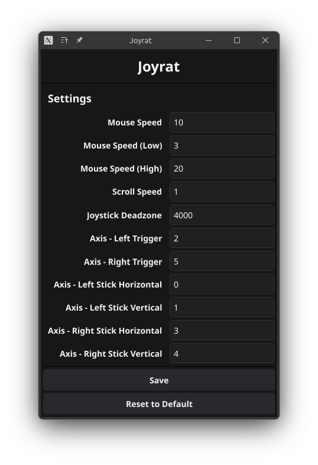

# Joyrat

Joyrat is a simple program for Linux that enables you to control your mouse using a controller.



## Default Features

- Move your mouse with the left stick
- Left click with the A button
- Right click with the B button
- Slow down the mouse for precise movement by holding down LT
- Speed up the mouse for quicker movement by holding down RT
- Scroll using the right stick
- Deadzone modifier
- A comprehensive settings panel that lets you rebind all of these options and more

## Requirements
- `go` installed on your distribution
- `sdl2` installed on your distribution

## Compiling and running

```bash
# Fetch dependencies
go mod tidy
# Build the app
go build app.go
# Copy the compiled binary to your bin directory
sudo cp app /usr/local/bin/joyrat
# Run joyrat
joyrat
```

## Usage

- Plug in your controller
- Open Joyrat using the `joyrat` command
- Enjoy

## Contributing

Pull requests are welcome. For major changes, please open an issue first
to discuss what you would like to change.

Please make sure to update tests as appropriate.

## License

[MIT](https://choosealicense.com/licenses/mit/) - See the `LICENSE` file